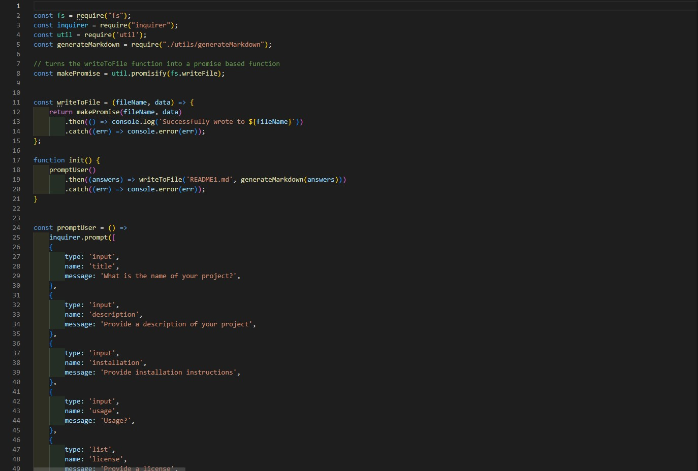
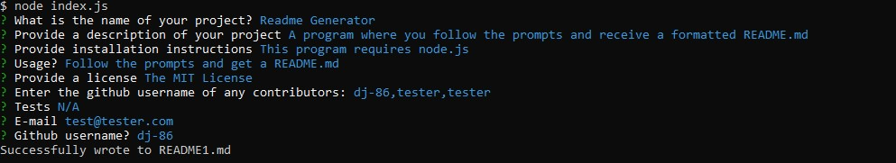

# README Generator
## Description
A program that generates a README file populated with user input
## Table of Contents
- [Installation](#installation)
- [Usage](#usage)
- [License](#license)
- [Contributing](#contributors)
- [Tests](#tests)
- [Questions](#questions)

## Images 

  
 
## Installation
Node.js (required)
## Usage
Follow the prompts and get a README
[Demo](https://watch.screencastify.com/v/QnHmhn0zivS5S5jM61WB)
## License
This project is licensed under The MIT License
## Contributors 

[dj-86](https://www.github.com/dj-86)  
## Tests
N/A
## Questions
If you have any questions feel free to contact me.
[dj-86](https://www.github.com/dj-86)
[davidmarkjones86@gmail.com](mailto:davidmarkjones86@gmail.com)

This README has been generated using a [README Generator](https://watch.screencastify.com/v/QnHmhn0zivS5S5jM61WB) 

